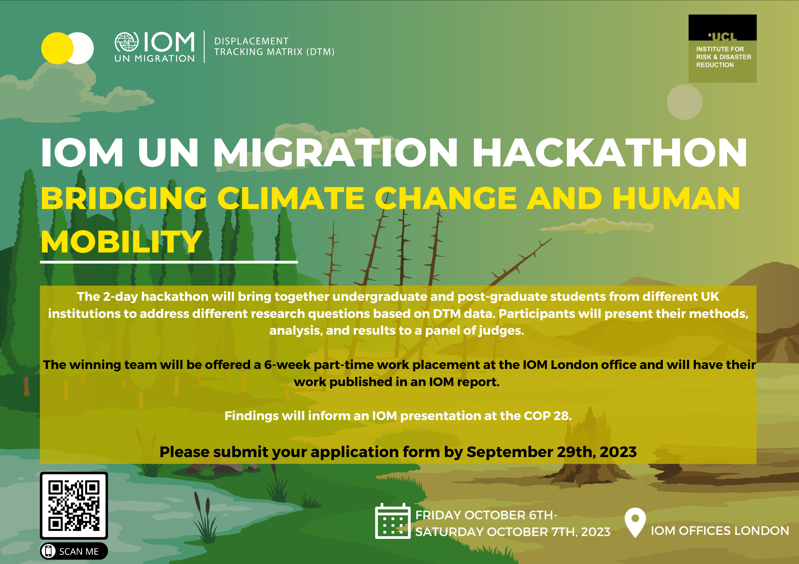

# **IOM - UCL 2023 Hackathon:** Resources for Participants

Congratulations for being selected for this edition of **IOM-UCL "Bridging Climate Change and Human Mobility"** hackathon event. To ensure you're well-prepared for this exciting journey, we've outlined the technical requirements and provided a comprehensive list of resources to support your data analysis endeavors.

{ width=500% height=100% }

